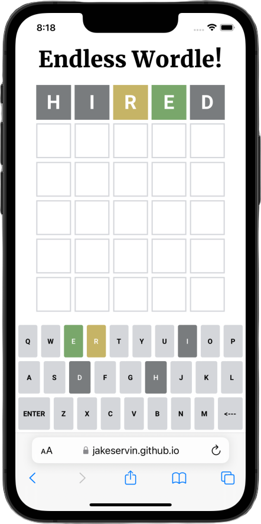

# Endless World!

## Overview:

This Wordle clone was built from scratch without any tutorials or looking at any relevant code. Endless Worldle has a dictionary of 400+ words for you to practice you wordle skills over and over again. Each time a user presses the enter key, the word is checked to see wether or not there is a valid number of letters and if the word actually exists via a free dictionary API. If the word exists, each letter is checked against the corresponding spot in the answer and the color of the square is changed accordingly. If the player guesses the word correctly, the win screen is displayed with the option to play again. If the player does not guess the word after the 5th try, the lose screen is displayed along with the option to play again.

## Technologies used:

- HTML
- CSS
- JavaScript

#### API:

- [Free Dictionary API](https://dictionaryapi.dev)

#### Built by www.jakeservin.dev
